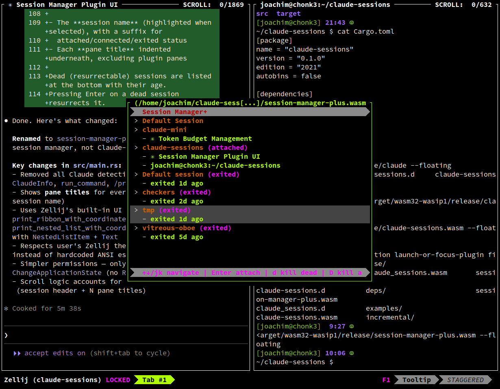

# zellij-sessioner

A [Zellij](https://zellij.dev) plugin that enhances the built-in session manager
by showing **pane titles** for each session. See at a glance what's running
everywhere — particularly useful with tools like [Claude Code](https://claude.ai/code)
that put their status in the terminal title.

The built-in session manager can show pane titles too, but they have to be
expanded manually one session at a time using keybindings. This plugin shows
them all at once. There is a [feature request](https://github.com/zellij-org/zellij/issues/4765)
to add an "expand all" option to the built-in session manager, which would
make this plugin unnecessary.



## Install

### Pre-built wasm (recommended)

Use the plugin directly from a GitHub release URL — Zellij downloads and
caches it automatically:

```
zellij action launch-or-focus-plugin \
  https://github.com/nomeata/zellij-sessioner/releases/latest/download/zellij-sessioner.wasm \
  --floating
```

Or pin a specific version:

```
https://github.com/nomeata/zellij-sessioner/releases/download/v0.1.0/zellij-sessioner.wasm
```

### Keybinding

The built-in session manager is bound to `Ctrl o` then `w`. You can **replace**
it with zellij-sessioner by overriding that binding in your Zellij config
(`~/.config/zellij/config.kdl`):

```kdl
keybinds {
    session {
        bind "w" {
            LaunchOrFocusPlugin "https://github.com/nomeata/zellij-sessioner/releases/latest/download/zellij-sessioner.wasm" {
                floating true
                move_to_focused_tab true
            };
            SwitchToMode "Normal"
        }
    }
}
```

Or if you prefer to keep the built-in and add this alongside it, bind a
different key (e.g. `e`):

```kdl
keybinds {
    session {
        bind "e" {
            LaunchOrFocusPlugin "https://github.com/nomeata/zellij-sessioner/releases/latest/download/zellij-sessioner.wasm" {
                floating true
                move_to_focused_tab true
            };
            SwitchToMode "Normal"
        }
    }
}
```

Then open it with `Ctrl o` then `e`.

### Layout (`zellij -l sessioner`)

To launch the plugin with `zellij -l sessioner` (similar to `zellij -l welcome`),
place a layout file at `~/.config/zellij/layouts/sessioner.kdl`:

```kdl
layout {
    pane borderless=true {
        plugin location="https://github.com/nomeata/zellij-sessioner/releases/latest/download/zellij-sessioner.wasm"
    }
}
show_startup_tips false
```

Zellij looks for layouts by name in `~/.config/zellij/layouts/` (or whatever
`layout_dir` is set to in your config).

### Build from source

Requires Rust with the `wasm32-wasip1` target.

```bash
# with Nix
nix develop && cargo build --release

# without Nix
rustup target add wasm32-wasip1
cargo build --release --target wasm32-wasip1
```

Then use the local build:

```bash
zellij action launch-or-focus-plugin \
  file:target/wasm32-wasip1/release/zellij-sessioner.wasm \
  --floating
```

## Keybindings

| Key | Action |
|-----|--------|
| `↑` / `k` | Move selection up |
| `↓` / `j` | Move selection down |
| `Enter` | Switch to selected session |
| `d` | Delete selected dead session |
| `D` | Delete all dead sessions |
| `Esc` / `q` | Close the plugin |

## How it works

Subscribes to Zellij's `SessionUpdate` event which provides the full session
list with pane manifests. For each session it shows:

- **Session name** with status (attached / connected / exited)
- **Pane titles** indented underneath (plugin panes excluded)

Dead (resurrectable) sessions appear at the bottom with their age.

## Releasing

1. Bump the version in `Cargo.toml`
2. Run `cargo build` to update `Cargo.lock`
3. Commit: `git commit -am "Release vX.Y.Z"`
4. Tag: `git tag vX.Y.Z`
5. Push: `git push && git push --tags`

GitHub Actions will build the `.wasm` and create a release automatically.

## What about the name?

The name follows the German convention of deriving a profession from the task
performed: a *Sessioner* is one who manages sessions, just as a *Fensterputzer*
is one who cleans windows.

## Credits

This plugin was vibe-coded with [Claude Code](https://claude.ai/code).
